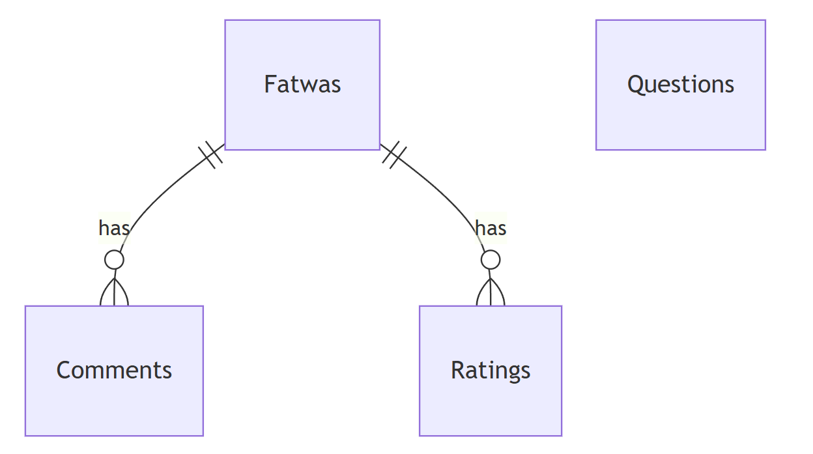

# Design Document

By Noor Zalouk

Video overview: <https://www.youtube.com/watch?v=t6ikFqRpoE8>

## Scope

the database for Islamweb fatwas the purpose of the database is providing all fatwas in islamweb english version to help muslims know more about islam and give them answeres to thier questions with the ability to ask new questions, answer not answered questions, comment on fatwas and rate fatwas.

the database includes:
* fatwas, including question and answer.
* questions, ability to ask a question and to answer a question.
* comments, ability to comment on a fatwa.
* ratings, ability to rate a fatwa.

other islamweb data like the Fiqh library, Quran Recitations, Lectures, E-Books and Articles are out of the scope of this database.

## Functional Requirements

the user should be able to:
* search for a fatwa.
* comment on a fatwa.
* rate a fatwa.
* ask a new question.
* answer a  not answered question.

the user should not be able to:
* edit a pre-existing fatwa.
* answer a pre-answered question.
* ask a pre-answered question.

## Representation
Entities are captured in SQLite tables with the following schema.

### Entities

The database includes the following entities:

#### Fatwas

the `fatwas` table includes:
* `id` which assigns a unique id which has an `INTEGER` type affinity to each fatwa and it has a `PRIMARY KEY` constraint applied.
* `subject` the subject of the fatwa which has a `TEXT` type affininty and has a `NOT NULL` constraint applied to ensure each fatwa has a subject and a `CHECK("subject" IN (islamweb subjects))` constraint apllied to ensure the fatwa falls in the supported subjects.
* `title` the title of the question which has a `TEXT` type affinity and has a `NOT NULL` constraint apllied to ensure each fatwa has a title.
* `date` the date at which the fatwa was added which has a `NUMERIC` type affinity and has a `NOT NULL` constraint applied to ensure each fatwa has a date with `DEFAULT CURRENT_TIMESTAMP` so that if the user did not provide a date it automatically assigns the current date.
* `question` the question which has a `TEXT` type affinity and has a `NOT NULL` constraint applied to ensure each fatwa has a question and has a `UNIQUE` constraint applied to prevent duplicate questions.
* `answer` the answer to the question which has a `TEXT` type affinity and has a `NOT NULL` constraint applied to ensure each fatwa has an answer.

#### Questions

the `questions` table includes:
* `id` which assigns a unique id which has an `INTEGER` type affinity to each question and it has a `PRIMARY KEY` constraint applied.
* `subject` the subject of the question which has a `TEXT` type affinity and has a `NOT NULL` constraint applied to ensure each question has a subject and a `CHECK("subject" IN (islamweb subjects))` constraint applied to make sure the question is in the supported subjects.
* `title` the title of the question which has a `TEXT` type affinity and has a `NOT NULL` constraint apllied to ensure each question has a title.
* `question` the question which is has `TEXT` type affinity and has a `NOT NULL` constraint applied to ensure each question has a question and a `UNIQUE` constraint applied to prevent duplicate questions.
* `answer` the answer to the question which has a `TEXT` type affinity with `DEFAULT NULL` so that a question initially has no answer.

#### Comments

the `comments` table includes:
* `id` which assigns a unique id which has an `INTEGER` type affinity to each comment and it has a `PRIMARY KEY` constraint applied.
* `fatwa_id` the id of the fatwa on which the comment was added which has an `INTEGER` type affinity and has a `FOREIGN KEY` constraint applied which `REFERENCES "fatwas"("id")`.
* `comment` the comment which has `TEXT` and has a `NOT NULL` constraint applied to ensure each comment has a comment.

#### Ratings

the `ratings` table includes:
* `id` which assigns a unique id which has an `INTEGER` type affinity to each rating and it has a `PRIMARY KEY` constraint applied.
* `fatwa_id` the id of the fatwa on which the rating was added which has an `INTEGER` type affinity and has a `FOREIGN KEY` constraint applied which `REFERENCES "fatwas"("id")`.
* `rating` the rating which has an `INTEGER` and has a `NOT NULL` constraint applied to ensure each rating has a rating and a `CHECK(1 <= "rating" AND "rating" <= 5)` constraint applied to make sure rating falls in a scale from one to five.

### Relationships

* One fatwa may have zero to many comments. zero if no one yet commented on this fatwa and many if multiple users commented on this fatwa.
* a comment must point at only one fatwa so that no user can with one comment comment on two fatwas.
* One fatwa may have zero to many ratings. zero if no one yet rated this fatwa and many if multiple users rated this fatwa.
* a rating must point at only one fatwa so that no user can with one rating rate two fatwas.
* `questions` table is isolated because it is like a temporary repository for fatwas in which questions wait to be answered and the be moved along with the answer to `fatwas` table by `iftaa` trigger.

## Optimizations

* `q&a` index which optimizes the search on `fatwas`(`question`, `answer`) because the q&a are the most important part of a fatwa.
* `iftaa` trigger which after inserting an `answer` to a question in `questions` table will add a copy of the question and answer to
`fatwas` table and then delete the question from the `questions` table so that it automates the process of answering.

## Limitations

* the `questions` table assumes that the user will just insert a question whithout the answer so that another user would answer but if someone
inserted both the question and answer the fatwa will not be moved to the `fatwas` table.
* the `date` column in `fatwas` table provides the Gregorian calendar with the Hijri calendar so `ORDER BY "date"` can not be
used effictively.
